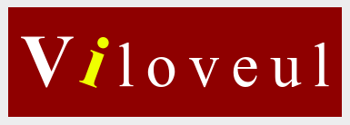

<h1 align="center">Viloveul Framework</h1>
<p align="center"></p>

## 1. Requirement
- PHP7 (direkomendasikan 7.3)
- Composer
- OpenSSL
- ext: php-amqp (Optional)
- ext: php-redis (Optional)
- ext: php-apcu (Optional)

## 2. Installation
Instalasi menggunakan composer :
```shell
composer create-project viloveul-project/framework direktori-project-anda
cd direktori-project-anda
```
Instalasi dengan git clone :
```shell
git clone https://github.com/zafex/viloveul-project-framework.git direktori-project-anda
cd direktori-project-anda
composer install
composer run fresh
composer run bootstrap
composer run genrsakey
```
Check hello command :
```shell
sbin/viloveulc hello
```

Run development server with php built-in server
```shell
php -S localhost:8080 -t public
```

## 3. Nginx
```conf
server {
    listen 8080;
    root /DIREKTORI-PROJECT-ANDA/public;
    index index.php;
    if (!-e $request_filename) {
        rewrite ^.*$ /index.php last;
    }
    location ~ \.php$ {
        fastcgi_pass unix:/run/php/php7.3-fpm.sock;
        fastcgi_index index.php;
        fastcgi_param SCRIPT_FILENAME $document_root$fastcgi_script_name;
        fastcgi_param PHP_VALUE "error_log=/var/log/nginx/api.log";
        fastcgi_buffers 16 16k;
        fastcgi_buffer_size 32k;
        fastcgi_read_timeout 300;
        include fastcgi_params;
    }
}
```